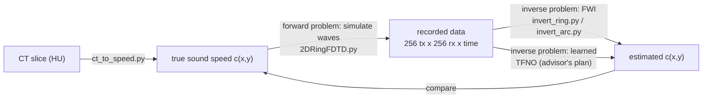
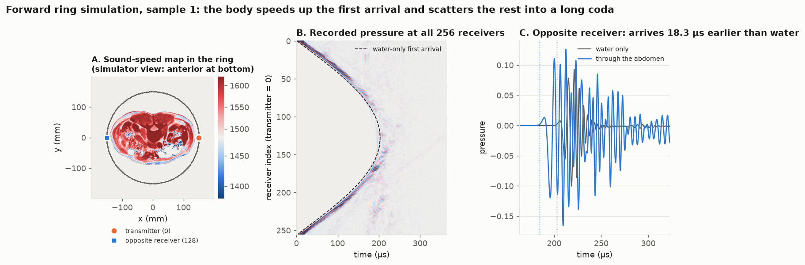
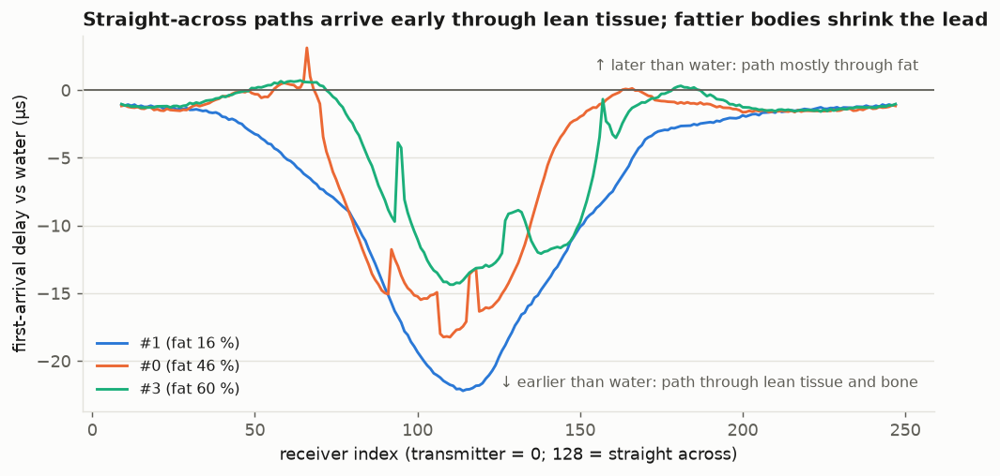
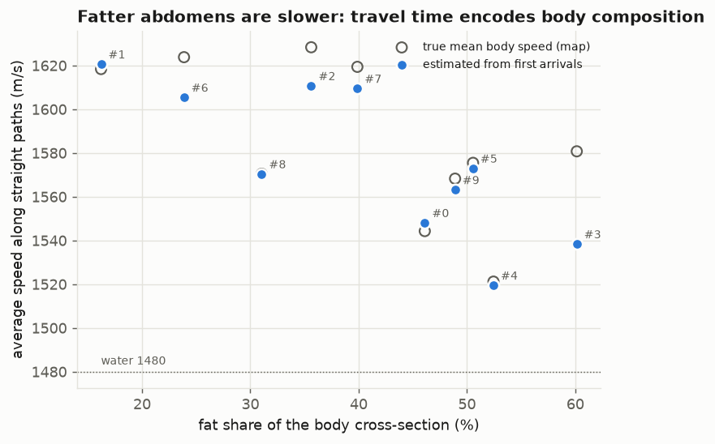
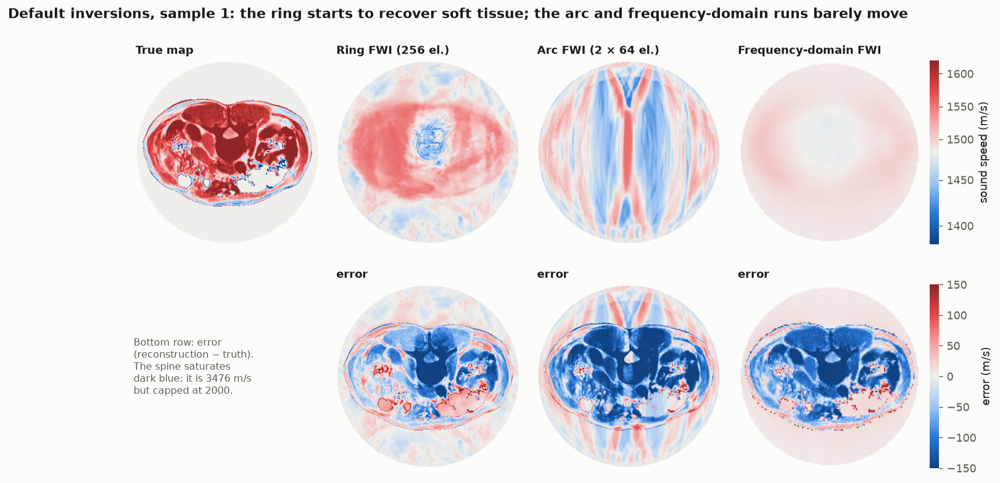

# Learning guide: ultrasound tomography, simulation and this codebase

*For Desmond, as of 2026-10-06. Read top to bottom the first time; later, jump to the section you need. Each section ends with "In this repo", pointing at the code, and the last sections are hands-on exercises.*

## 1. The big picture in five sentences

1. **Ultrasound computed tomography (USCT)** surrounds a body part with many ultrasound transducers, fires them one at a time, and records how the waves arrive everywhere else. From that, it computes an image of a physical property, here the **speed of sound** c(x, y).
2. Sound speed differs by tissue (fat is slower than water, muscle and organs are faster, bone much faster), so a sound-speed image is a map of **tissue composition**. USCT for the breast is already used clinically; the abdomen is harder because it is larger and contains bone and gas.
3. Turning recordings into an image is an **inverse problem**. We can *simulate* what a known body would record (the forward problem), but going backwards is non-linear and can fail.
4. This codebase simulates the forward problem with a 2D wave solver. It solves the inverse problem with **full-waveform inversion (FWI)**, compares a full **ring** of transducers with two small **arcs**, and is building toward a **neural network** (a TFNO) that learns the inverse directly from simulated examples.
5. Your synthetic CT slices supply realistic bodies with a **known** true sound-speed map, which is what lets every method be scored.



**Why the advisor cares.** His group published neural-operator ultrasound tomography before: Dai, Penwarden, Kirby & Joshi, *Neural Operator Learning for Ultrasound Tomography Inversion*, MIDL 2023 (arXiv:2304.03297). Read it first; it frames this repo. His `TFNO_Full_Ring_Plan.tex` extends it to full-waveform data and 256 elements.

**Why L3.** Clinically, body composition is measured on one CT slice through the third lumbar vertebra (L3). Subcutaneous fat, visceral fat and muscle areas there correlate with whole-body amounts. That makes L3 a natural test slice for "can ultrasound tell fat from lean tissue?".

## 2. Physics you need

### 2.1 Waves, speed, wavelength

A pressure wave of frequency f travels at speed c with wavelength λ = c / f. **Resolution** in imaging is roughly λ/2, so higher frequency means a sharper image. But attenuation grows with frequency, so on large bodies the waves don't make it through.

| Frequency | λ in water (1480 m/s) | λ in muscle (about 1580 m/s) | Rough best resolution |
| --- | --- | --- | --- |
| 25 kHz | 59 mm | 63 mm | about 30 mm |
| 100 kHz | 15 mm | 16 mm | about 7 mm |
| 250 kHz | 5.9 mm | 6.3 mm | about 3 mm |
| 1 MHz (breast USCT range) | 1.5 mm | 1.6 mm | under 1 mm |

This repo uses 25–250 kHz, which is very low for medical ultrasound. That's a deliberate choice: a 300 mm abdomen is too lossy for MHz transmission. Expect images blurred at the centimetre-to-millimetre scale, not crisp CT.

### 2.2 Tissue values

Approximate values; this repo's `ct_to_speed.py` cites Culjat et al. 2010 for its constants.

| Material | Sound speed (m/s) | Density (kg/m³) | Notes |
| --- | --- | --- | --- |
| Water (20 °C) | 1480 | 1000 | The coupling bath around the body |
| Fat | about 1430–1480 | about 920 | **Slower** than water |
| Muscle | about 1550–1590 | about 1050 | |
| Liver | about 1595 | about 1060 | |
| Bone (cortical) | about 3500 | about 1900 | Very fast and very dense |
| Air / bowel gas | 330 | 1.2 | Almost total reflection |

### 2.3 Impedance and reflection: why bone and gas are hard

At a boundary, the fraction of the wave reflected depends on the **acoustic impedance** Z = ρc:

```latex
R = \frac{Z_2 - Z_1}{Z_2 + Z_1}
```

- **Soft tissue to soft tissue:** |R| of a few percent, so most energy goes through. This is what transmission tomography relies on.
- **Soft tissue to bone:** |R| ≈ 0.6, so a lot reflects. Bone also carries shear waves.
- **Soft tissue to gas:** |R| ≈ 1, so almost nothing goes through. Bowel gas is why abdominal ultrasound often "can't see".

The 2D solver here models **sound speed only** (constant density), so it gets these reflections wrong. `ct_to_speed.py --air-as-water` replaces gas with water, which keeps simulations stable but hides the gas problem. See `critical_review.md`, sections 4–5. The advisor's 1D simulator *does* include density; Exercise 1 shows the difference.

### 2.4 2D versus 3D

Real transducers radiate in 3D. A 2D simulation treats each element as an infinite line source, so waves spread cylindrically, and out-of-plane anatomy doesn't exist. Fine for learning and method development; it overstates how cleanly a real slice can be imaged.

## 3. Simulating waves: FDTD and FDFD

### 3.1 The equation

The solver uses the constant-density scalar wave equation for pressure u(x, y, t):

```latex
\frac{\partial^2 u}{\partial t^2} = c(x,y)^2 \left(\frac{\partial^2 u}{\partial x^2} + \frac{\partial^2 u}{\partial y^2}\right)
```

### 3.2 Finite differences in time (FDTD)

- **Grid:** the body is a grid of pixels of size Δx (about 0.8 mm here).
- **Leapfrog:** compute u at the next time step from the current and previous steps, using finite differences for the second derivatives.
- **CFL condition:** the time step must satisfy Δt ≤ CFL × Δx / c_max (CFL = 0.45 here). Fast bone (3476 m/s) forces a small Δt, so bone makes simulations slower.
- **Points per wavelength (PPW) = λ_min / Δx.** Too few, and the numerical wave travels at the wrong speed (**numerical dispersion**). A second-order scheme like this one usually wants 10 or more. Our runs have 4–7 at the top of the band. This is a real open issue (`critical_review.md`, section 5).
- **Absorbing boundaries:** the grid has edges, so a first-order Mur condition tries to let waves leave without reflecting back.
- **Source:** a Hann-windowed linear chirp (100→250 kHz over 20 µs) injected at the transmitting element.

### 3.3 Frequency domain (FDFD)

Instead of stepping through time, solve one frequency at a time with the **Helmholtz equation**, ∇²U + (ω/c)²U = −S. Each frequency is one large linear system (solved here with GMRES and a multigrid preconditioner). It's cheaper when you need only a few frequencies. That's what `fdfd_ring/` does.

**In this repo:**

| File | Role |
| --- | --- |
| `1DWaveSimulation.py`, `Assignment 1/` | 1D FDTD with density: the best place to build intuition |
| `fdtd2d/wave.py` | The wave equation operator (`ScalarWave2D`) |
| `fdtd2d/solver.py` | Leapfrog time stepper + Mur boundaries (NumPy) |
| `fdtd2d/torch_backend.py` | The same on GPU with PyTorch, batched transmitters, adjoint for gradients |
| `fdtd2d/array.py` | Ring and arc transducer geometry, injecting sources and sampling receivers |
| `fdtd2d/sources.py` | The chirp |
| `fdtd2d/ct_medium.py` | Puts a CT sound-speed map on the simulation grid, centres it, adds the ring |
| `fdtd2d/phantoms.py` | Simple test bodies: disk, Shepp–Logan |
| `fdfd_ring/forward_ring_fdfd.py` | Frequency-domain forward solver |

## 4. The acquisition: ring and arc

- **Ring:** 256 elements on a circle around the body. Each element fires in turn while all 256 record, giving a data cube of 256 transmitters × 256 receivers × T time samples. Every direction through the body is measured.
- **Arc:** two 64-element arcs of about 30°, one transmitting from below and one receiving from above. Cheaper hardware, but most directions are never measured. Section 5.4 explains why that matters.

How to read the data, using our own figures:



- **Panel B, the "gather":** one transmitter's shot. Each row is a receiver, time runs left to right, and colour is pressure. The bright curved band is the **first arrival**. Near the transmitter the wave only crossed water; across the ring it crossed the body and arrived *earlier* than the dashed water-only curve, because tissue is mostly faster than water. The faint wiggles afterwards are **scattering**.
- **Panel C:** a single receiver. Notice that the *peak* comes later than the *first arrival*. Travel time must be picked at the first arrival.

**In this repo:** `2DRingFDTD.py` (forward ring, one or all transmitters), `2DArcFDTD.py` (forward arc, phantoms only).

## 5. The inverse problem

Forward: c → data. Inverse: data → c. There are two families of methods, plus the learned approach in section 6.

### 5.1 Travel-time tomography (robust, blurry)

Pick the first-arrival time on every transmitter–receiver pair. Each time is approximately the integral of slowness 1/c along the ray path. Solving for 1/c from many such integrals (as in X-ray CT, but with possibly bent rays) gives a **smooth, low-resolution** sound-speed map. It almost never fails badly.



Each curve here is one transmitter's first-arrival delay versus water. Lean bodies give big negative delays (fast); fat pulls the delay up. We found that even one transmitter's travel times recover each body's average speed within a median 4.5 m/s.



### 5.2 Full-waveform inversion (sharp, fragile)

FWI uses the **whole waveform**, not just its first arrival:

1. **Guess** a model m(x, y). This repo uses slowness squared, m = 1/c².
2. **Simulate** the data that guess would produce.
3. **Misfit:** J(m) = ½ Σ (simulated − observed)², summed over all transmitters, receivers and times.
4. **Gradient:** ∂J/∂m comes from one extra "adjoint" simulation, which runs the residuals backwards in time. The cost is about one forward run, not one per pixel.
5. **Update** m with an optimizer (gradient descent, CG, Adam, L-BFGS), stay within bounds [c_min, c_max], and repeat.

Key ideas you will hear:

- **Cycle skipping.** If the starting model predicts arrivals more than half a period off, the misfit has the wrong valley nearby, and FWI "locks" onto the wrong cycle. Our bodies shift arrivals by up to 22 µs; half a period is 20 µs at 25 kHz and 5 µs at 100 kHz. Starting from water is therefore risky. The standard fix is to start FWI from a travel-time tomography model.
- **Multiscale (frequency continuation).** Invert low frequencies on a coarse grid first (long periods, so less cycle skipping), then refine. `--multiscale` does 25–75 kHz → 50–125 kHz → 100–250 kHz.
- **Step size.** Too small and nothing moves; too big and it diverges. Our default runs were capped at about 1.6 m/s per iteration (`critical_review.md`, section 6).
- **Regularization** (`--reg`): penalizes rough images; needed when data are incomplete.
- **Inverse crime:** generating test data with the same simulator and grid as the inversion. Results look better than reality. Avoid it by simulating data on a finer grid and adding noise.

### 5.3 What our first inversions showed



The ring recovered the body outline and bulk speed, cutting soft-tissue error by 21 %. The arc produced vertical streaks and got worse. The frequency-domain run barely moved. All three are limited mostly by settings (step size, starting model, bounds), not by physics. `critical_review.md` shows that a 10× step size alone brings out the spine.

### 5.4 Limited angle (arcs)

Each transmitter–receiver pair mostly tells you about structure *across* its line of sight. Two opposed arcs see only near-vertical lines of sight, so horizontal structure is unconstrained. This is the "missing wedge", and it shows up as streaks along the arc axis. More data from the same arcs doesn't fix it; **prior knowledge** (regularization, anatomical priors, learned models) does.

**In this repo:**

| File | Role |
| --- | --- |
| `invert_ring.py` | Ring FWI: gradient descent, CG, Adam; multiscale; `--gradient-check` verifies the adjoint |
| `invert_arc.py` | Arc (limited-angle) FWI, the same machinery |
| `fdtd2d/inversion/` | Misfit, adjoint gradient, CG, medium handling, the neural parameterization |
| `fdtd2d/inversion/neural.py` | `--model neural`: represents c(x, y) with a small network instead of pixels (newest feature) |
| `fdfd_ring/invert_ring_fdfd.py` | Frequency-domain FWI (Adam or projected L-BFGS) |
| `tests/test_neural.py` | Tests for the neural parameterization |

## 6. Learned inversion: the advisor's TFNO plan

A **neural operator** learns a map between functions, here from data to image, using layers that act in Fourier space (FNO: Li et al., ICLR 2021). **TFNO** compresses those Fourier weights with a tensor factorization (the `neuraloperator` library). The plan in `TFNO_Full_Ring_Plan.tex`:

- **Input:** the 256 × 256 transmitter–receiver grid. Each pair's recording becomes a complex frequency response at 16 frequencies between 100 and 250 kHz (about 70 channels with the pulse and geometry features).
- **Output:** the slowness-squared contrast relative to water on a 512 × 512 grid. It's then converted to sound speed.
- **Training data:** at least 1000 simulated examples from CT slices, with **one fixed geometry** (ring radius about 230 mm, about 1 mm grid), split by patient.
- **Baselines:** adjoint FWI (`invert_ring.py`), a homogeneous-water image, and a U-Net.

Your CT generator is exactly the data source this needs. FWI is the method the TFNO must beat.

## 7. Map of the codebase

| Path | What it is | Start here? |
| --- | --- | --- |
| `README.md` | One line | — |
| `Assignment 1/` | 1D simulations and an explainer transcript | **Yes, first** |
| `1DWaveSimulation.py` | 1D FDTD (speed + density) | Yes |
| `2DRingFDTD.py` | 2D forward ring, phantoms or CT | Yes, second |
| `2DArcFDTD.py` | 2D forward arc, phantoms | After the ring |
| `ct_to_speed.py` | CT slice → tissue labels + sound speed | When you start CT work |
| `invert_ring.py`, `invert_arc.py` | FWI (time domain) | Third, on phantoms |
| `fdfd_ring/` | Frequency-domain forward + FWI | Later |
| `fdtd2d/` | The shared library behind all of these | Read alongside the scripts |
| `TFNO_Full_Ring_Plan.tex` (`.pdf`) | The advisor's research plan | **Read early** |
| `3DTecxtureExample.py`, `*.zip`, `*.png`, `*.npz`, `*.dcm` | Demos and saved results | Browse |
| `desmond/` | **Your workspace**: CT generation, analysis, docs | — |

Conventions: run everything from the repository root inside `conda activate soundwave`. Pass `--device cuda:0` (the default device fails under torch 2.14). Always pass `--save-figure <path in desmond/>`, or the scripts overwrite the PNGs in the root.

## 8. Hands-on exercises

Each takes a few minutes on the A6000. Put outputs in `desmond/data/exercises/` (gitignored) and write down what you see; the questions tell you what to look for.

**Exercise 1: impedance in 1D.** Run the 1D simulator with its animation.

```bash
python 1DWaveSimulation.py --animate
```

- Where does the wave reflect, and why?
- Read the docstring's R = (Z₂ − Z₁)/(Z₂ + Z₁). What would R be for tissue → gas?

**Exercise 2: the ring on a simple body.**

```bash
mkdir -p desmond/data/exercises
python 2DRingFDTD.py --phantom disk --device cuda:0 --no-show --save-figure desmond/data/exercises/ring_disk.png
python 2DRingFDTD.py --phantom none --device cuda:0 --no-show --save-figure desmond/data/exercises/ring_water.png
```

- Compare the gathers. How much earlier does the wave arrive through the 1800 m/s disk?
- Predict it first: Δt ≈ d(1/1480 − 1/1800) for a 40 mm disk.

**Exercise 3: an inversion that works.** Shepp–Logan with the defaults.

```bash
python invert_ring.py --phantom shepp-logan --multiscale --device cuda:0 --no-show --save-figure desmond/data/exercises/fwi_shepp.png
```

- Does the reconstruction match the true map?
- Why is this easier than the abdomen? Think about size, contrast and the starting model.

**Exercise 4: trust the gradient.** Run the adjoint check, which compares the adjoint gradient with finite differences.

```bash
python invert_ring.py --gradient-check --device cuda:0
```

- What do the relative errors tell you?

**Exercise 5: the step-size effect on a CT slice.** Repeat the experiment from `critical_review.md`.

```bash
D=desmond/data/generated/pathB_retrieved_n10/sample_0001
python desmond/src/capture_inversion.py --out desmond/data/exercises/ring_lr1e-9.npz -- invert_ring.py \
    --ct-speed $D/acoustic.npz --multiscale --device cuda:0 --no-show --save-figure desmond/data/exercises/ring_lr1e-9.png
python desmond/src/capture_inversion.py --out desmond/data/exercises/ring_lr1e-8.npz -- invert_ring.py \
    --ct-speed $D/acoustic.npz --multiscale --device cuda:0 --no-show --adam-lr 1e-8 --save-figure desmond/data/exercises/ring_lr1e-8.png
```

- Compare the reconstructed ranges.
- Explain them with "Adam moves each pixel by at most lr per step".

**Exercise 6: limited angle.** Run the arc on Shepp–Logan.

```bash
python invert_arc.py --phantom shepp-logan --multiscale --device cuda:0 --no-show --save-figure desmond/data/exercises/arc_shepp.png
```

- Where are the streaks?
- Which edges of the phantom are recovered, and which are lost?

**Exercise 7: frequency domain.** Run the quick FDFD inversion from `fdfd_ring/README.md`.

```bash
python fdfd_ring/invert_ring_fdfd.py --device cuda --grid-size 81 --n-elements 32 --n-shots 8 --shot-batch 8 \
    --frequencies-khz 50,75 --max-iter 5 --no-show --save-figure desmond/data/exercises/fdfd_quick.png
```

- How does changing `--frequencies-khz` change the result?

**Exercise 8: your own CT slice end to end.** Use `desmond/docs/simulation_pipeline.md`, sections 1–3.

- Generate a new sample with a different `--base-seed`.
- Convert it with `ct_to_speed.py`.
- Run the forward ring on it and on its water reference.
- Regenerate the figures for it.

## 9. Glossary

| Term | Meaning |
| --- | --- |
| Adjoint method | Computes the gradient of the misfit for all pixels with one extra (time-reversed) simulation |
| CFL | Stability limit on the time step: Δt ≤ CFL·Δx / c_max |
| Coda | The scattered signal after the first arrival |
| Cycle skipping | FWI converging to a model that is off by a whole wave period |
| FDTD / FDFD | Finite differences in the time domain / frequency domain |
| First arrival | The earliest energy reaching a receiver; its time is the travel time |
| FWI | Full-waveform inversion: fit the entire recorded waveform by adjusting the model |
| Gather | Image of one shot: receivers × time |
| HU | Hounsfield units, CT's density scale (water 0, air −1000) |
| Impedance Z = ρc | Sets reflection at boundaries |
| Inverse crime | Testing an inversion on data from the identical simulator and grid |
| L3 | Third lumbar vertebra; the standard slice for CT body composition |
| Misfit J | How far simulated data are from observed data |
| Missing wedge | Directions an array never measures (limited angle) |
| Neural operator / FNO / TFNO | Networks that learn maps between functions; TFNO factorizes FNO's Fourier weights |
| PPW | Grid points per wavelength; too few causes numerical dispersion |
| SAT / VAT | Subcutaneous / visceral adipose tissue (fat under the skin / around the organs) |
| Slowness squared m = 1/c² | The model parameter the inversions update |
| Travel-time tomography | Reconstructs smooth 1/c from first-arrival times |
| USCT | Ultrasound computed tomography |

## 10. Reading list (in this order)

1. **The advisor's plan:** `TFNO_Full_Ring_Plan.tex` / `.pdf` (in this repo).
2. **Dai, Penwarden, Kirby & Joshi (2023)**, *Neural Operator Learning for Ultrasound Tomography Inversion*, MIDL. arXiv:2304.03297.
3. **Virieux & Operto (2009)**, *An overview of full-waveform inversion in exploration geophysics*, Geophysics 74(6). The best FWI primer; medical FWI borrowed most of its ideas from seismology.
4. **Pratt (1999)**, *Seismic waveform inversion in the frequency domain*, Geophysics 64(3). Background for `fdfd_ring/`.
5. **Guasch et al. (2020)**, *Full-waveform inversion imaging of the human brain*, npj Digital Medicine. FWI on a real medical problem with bone (the skull).
6. **Li et al. (2021)**, *Fourier Neural Operator for Parametric PDEs*, ICLR. The FNO paper.
7. **Mast (2000)**, *Empirical relationships between acoustic parameters in human soft tissues*, Acoustics Research Letters Online. The source of `ct_to_speed.py`'s speed regression.
8. **Culjat et al. (2010)**, *A review of tissue substitutes for ultrasound imaging*, Ultrasound Med Biol 36. The tissue speeds used in `ct_to_speed.py`.
9. **Shen et al. (2004)**, J Appl Physiol, on single-slice (L3) body composition. Why one abdominal slice predicts whole-body fat and muscle.

Items 3–9 are cited from memory. Check titles and years before quoting them in writing.

## 11. Where to go next

- `desmond/docs/critical_review.md`: what is wrong so far and the phased plan.
- `desmond/docs/simulation_pipeline.md`: how the samples and simulations were made, with figures.
- `desmond/docs/model_notes.md`: the MAISI CT model reference.
