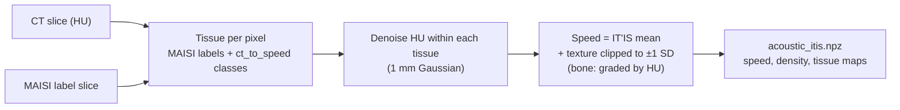
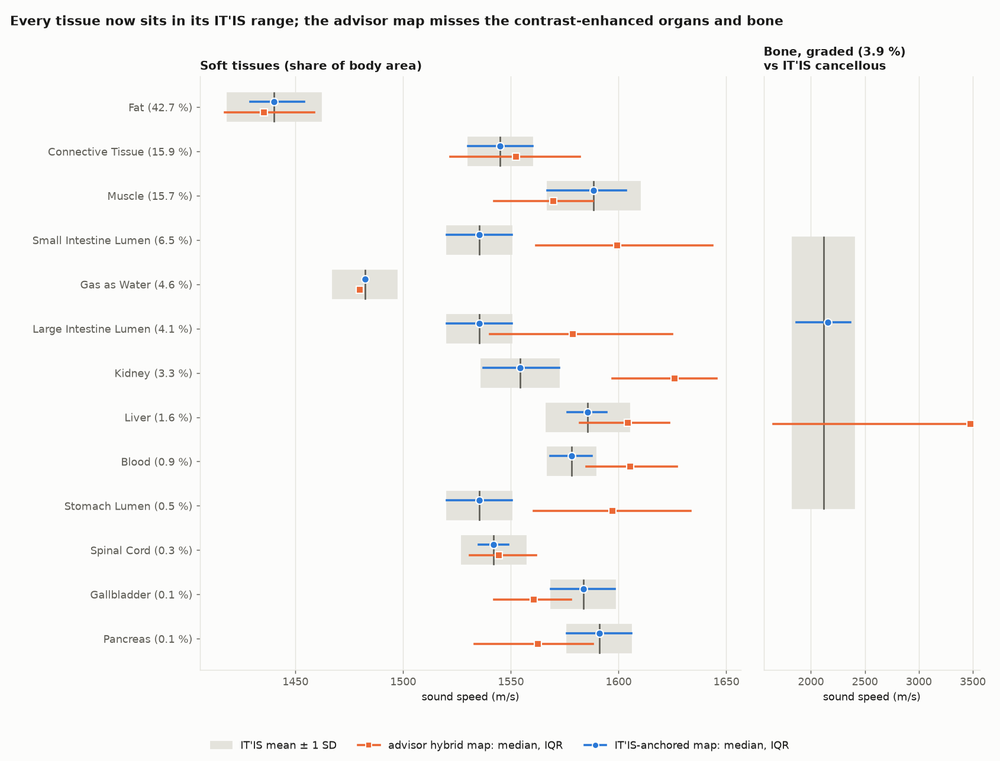
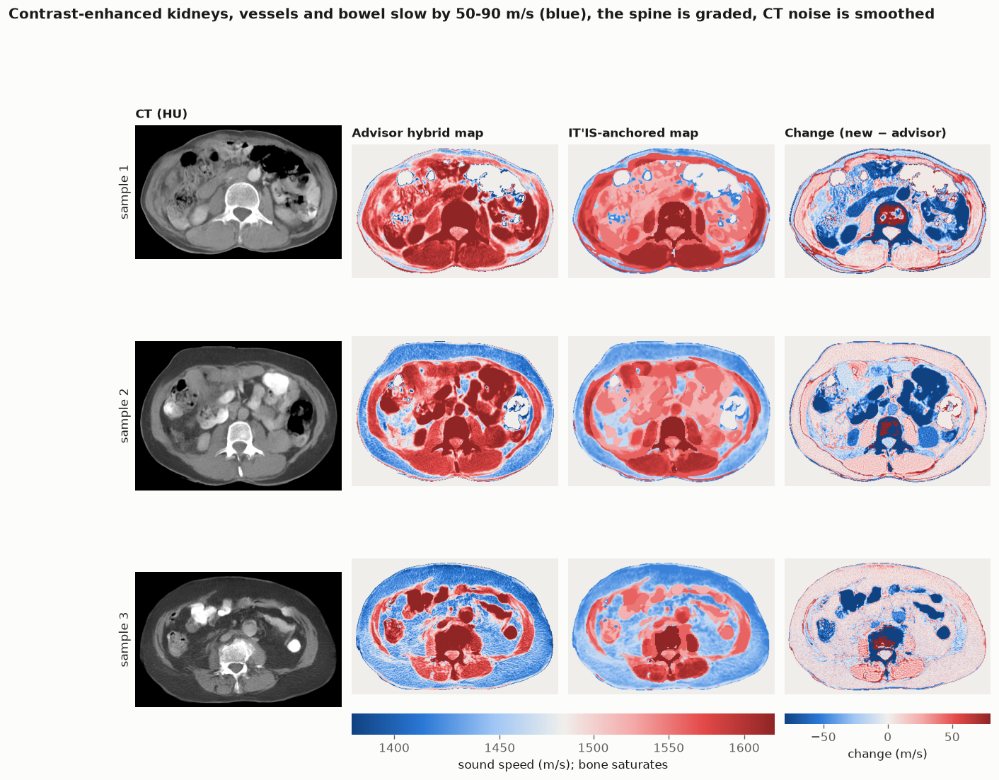
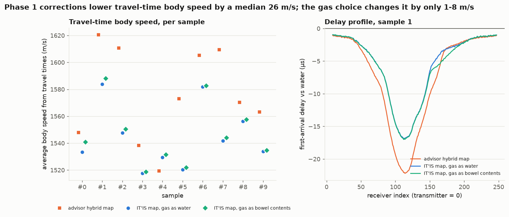

# Phase 1: physically defensible sound-speed maps

*Completed 2026-10-07. Part of the plan in [critical_review.md](critical_review.md); modelling choices and their reasons are in [decisions.md](decisions.md).*

## Summary

Every tissue in the 10 synthetic L3 slices now has a sound speed inside its published range: the IT'IS Tissue Properties Database mean ± 1 SD. The advisor's `ct_to_speed.py` hybrid map stays in range for fat, muscle, connective tissue, liver and spinal cord. It falls outside for the tissues the synthetic CT's contrast agent inflates:

- kidney, +72 m/s;
- blood, +27 m/s;
- bowel contents, +44 to +64 m/s;
- the spine, which gets dense-bone speed over spongy bone.

The corrections matter downstream. They lower each body's travel-time speed by a **median 26 m/s** (range −68 to +10). The fat-share signal in travel times sharpens from r = −0.81 to **r = −0.97**. How gas is filled in changes travel-time speed by only 1–8 m/s.

New code (the advisor's `ct_to_speed.py` is called, not modified):

- `desmond/src/speed_map.py`: builds the maps
- `desmond/configs/tissue_map.yaml`: the rules, editable
- `desmond/configs/itis_tissue_properties.csv`: IT'IS values with provenance
- `desmond/src/validate_speed_maps.py`: the table and figures below
- `desmond/tests/test_speed_map.py`: 9 unit tests

## What the mapping does



Each body pixel gets one tissue, in this priority order:

1. **Bone label** (vertebrae, ribs, pelvis): speed and density graded linearly in HU. Red marrow (1450 m/s) at 100 HU, cancellous bone (2118 m/s) at 200 HU, cortical bone (3515 m/s) at 1000 HU.
2. **Gas** (below −190 HU): water by default, or bowel contents or air.
3. **Fat** (−190 to −30 HU), even inside an organ label, because those pixels are partial volume.
4. **Organ label**, mapped to its IT'IS tissue (liver, kidney, blood vessels, bowel contents, paraspinal and psoas muscle, …).
5. **Otherwise**, the advisor's tissue class:
    - abdominal-wall muscle → muscle;
    - unlabeled visceral tissue → connective tissue;
    - unlabeled pixels above 200 HU → connective tissue, since they're contrast agent, not bone.

Within each tissue, speed = IT'IS mean + 1.0 m/s per HU × (denoised HU − that tissue's median HU in the slice), clipped to ±1 SD. Subtracting the median removes the contrast agent's offset while keeping realistic variation inside organs.

The output has the same `speed_m_s`, `body_mask` and `spacing_mm` keys as `ct_to_speed.py`'s, with the identical body mask. Every advisor script that takes `--ct-speed` reads it unchanged, with the same ring and grid.

## Validation against IT'IS

| Tissue | Share of body | IT'IS mean ± SD (studies) | Advisor map median [IQR] | New map median [IQR] | Advisor in range | New in range |
|---|---|---|---|---|---|---|
| Fat | 42.7 % | 1440 ± 22 (16) | 1436 [1417–1459] | 1440 [1429–1454] | yes | yes |
| Connective tissue | 15.9 % | 1545 ± 15 (2) | 1552 [1522–1582] | 1545 [1530–1560] | yes | yes |
| Muscle | 15.7 % | 1588 ± 22 (24) | 1570 [1542–1588] | 1588 [1567–1603] | yes | yes |
| Small intestine contents | 6.5 % | 1535 ± 15 (1) | 1599 [1562–1644] | 1535 [1520–1550] | no | yes |
| Gas (as water) | 4.6 % | 1482 | 1480 | 1482 | yes | yes |
| Large intestine contents | 4.1 % | 1535 ± 15 (1) | 1579 [1540–1625] | 1535 [1520–1550] | no | yes |
| Bone, graded (vs cancellous) | 3.9 % | 2118 ± 289 (5) | 3476 [1653–3476] | 2156 [1866–2367] | no | yes |
| Kidney | 3.3 % | 1554 ± 18 (7) | 1626 [1597–1645] | 1554 [1537–1572] | no | yes |
| Liver | 1.6 % | 1586 ± 19 (10) | 1604 [1582–1624] | 1586 [1576–1594] | yes | yes |
| Blood | 0.9 % | 1578 ± 11 (9) | 1605 [1585–1627] | 1578 [1568–1587] | no | yes |
| Stomach contents | 0.5 % | 1535 ± 15 (1) | 1597 [1561–1633] | 1535 [1520–1550] | no | yes |
| Spinal cord | 0.3 % | 1542 ± 15 (1) | 1544 [1531–1562] | 1542 [1535–1549] | yes | yes |
| Gallbladder | 0.1 % | 1584 ± 15 (1) | 1561 [1542–1578] | 1584 [1569–1598] | no | yes |
| Pancreas | 0.1 % | 1591 ± 15 (1) | 1563 [1533–1588] | 1591 [1576–1606] | no | yes |

**Pass rule:** the median over every pixel of that tissue, pooled across the 10 slices, lies within the IT'IS mean ± 1 SD. A tissue measured in a single study uses ±15 m/s. The full table is in `desmond/docs/figures/phase1/tissue_speed_table.csv`.



**Read this honestly:** the new map passes *by construction*, because each tissue is anchored to its IT'IS mean. The table shows three things:

- **The implementation is correct:** no tissue drifts off its anchor through edges, denoising or texture.
- **Where the advisor's mapping falls outside the literature** (the "no" rows), and by how much.
- **That the texture stays realistic:** every new interquartile range is no wider than the IT'IS ±1 SD (equal to it where the clip is active).

**It does not show the maps are physically true.** That rests on the IT'IS values themselves. Bowel contents, gallbladder, pancreas and spinal cord each come from a single study, and IT'IS has no measured value at all for the bowel and stomach *walls*.

A correction to my earlier review: the advisor's fat median (1436 m/s) is **within** the IT'IS range. Its fat problem was a noisy low tail (25 % of fat pixels below 1418 m/s), not the typical value.



Blue in the change column is where the new map is slower: contrast-enhanced kidneys, vessels and bowel, and the outer spine. Red is faster: the cancellous vertebral body that the advisor's threshold had left at soft-tissue speed, and some muscle.

## Effect on the simulations

The forward ring simulation (`2DRingFDTD.py`, transmitter 0) was rerun on all 10 slices with the new maps: gas as water, and gas as bowel contents. It was compared with the earlier runs on the advisor's maps, against the same water reference.



| Comparison (10 slices) | Advisor map | IT'IS map, gas as water | IT'IS map, gas as bowel contents |
| --- | --- | --- | --- |
| Opposite-receiver first arrival vs water | −9.1 to −21.6 µs | −8.5 to −16.2 µs | −8.6 to −16.2 µs |
| Travel-time body speed minus the advisor map's | — | median −26 m/s (−68 to +10) | median −26 m/s (−66 to +12) |
| Travel-time speed minus true mean body speed | median −4 m/s (−43 to +4) | median +12.6 m/s (+9 to +18) | similar |
| Correlation of fat share with travel-time speed | r = −0.81 | **r = −0.97** | — |

What this means:

1. **The corrections are not cosmetic.** Contrast and bone artifacts had made every body look about 26 m/s faster than its tissues are. That is about half of the fat-vs-lean contrast we want to measure.
2. **The body-composition signal is much cleaner.** With realistic organ speeds, travel time tracks fat share almost perfectly on these 10 slices (r = −0.97, fat shares 17–60 %). Ten samples is still small.
3. **Travel times now overestimate the mean speed consistently, by 9–18 m/s.** First arrivals follow the *fastest* path (through muscle and bone), so a straight-ray average is biased fast. With the advisor's maps this bias was hidden in a much larger scatter. A consistent bias can be calibrated; a scattered one cannot.
4. **Gas handling barely matters for travel times** (1–8 m/s). Gas is under 5 % of the body, and the fastest paths go around it. It will matter more for amplitudes and full-waveform inversion, which also need a density-aware solver to treat gas properly.

## How to run

```bash
conda activate soundwave
RUN=desmond/data/generated/pathB_retrieved_n10
python desmond/src/speed_map.py --run $RUN                 # acoustic_itis.npz per sample (gas as water)
python desmond/src/speed_map.py --run $RUN --gas lumen     # acoustic_itis_gas-lumen.npz
python desmond/src/validate_speed_maps.py --run $RUN       # table + figures (forward effect needs the runs below)
# forward runs used for the "Effect on the simulations" section:
python 2DRingFDTD.py --ct-speed $RUN/sample_0001/acoustic_itis.npz --device cuda:0 --no-show \
    --save-figure $RUN/sample_0001/ring_acoustic_itis.png --save-traces $RUN/sample_0001/ring_traces_itis.npz
python -m pytest desmond/tests -m "not slow"               # includes the 9 speed-map tests
```

To change a modelling choice (another fat value, gas option, bone anchors, texture on or off), edit `desmond/configs/tissue_map.yaml` and rerun. No code changes are needed.

## Limits that remain (for Phase 2 onward)

- **Constant-density solver.** The density map is produced but unused, so bone and gas reflections are still wrong.
- **IT'IS gaps:** single-study tissues, and no measured bowel-wall speed.
- **Label quality.** Organ boundaries come from MAISI's masks; fat inside organ labels is reclassified by HU.
- **Unvalidated texture.** The within-tissue texture model (1 m/s per HU, clipped at ±1 SD) is plausible but unchecked against real tissue microstructure.
- **Unverified numerics.** The simulator still has 6.7–7.3 grid points per wavelength at 250 kHz. That's Phase 2.
