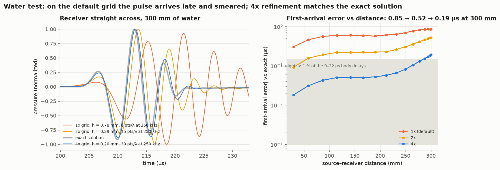
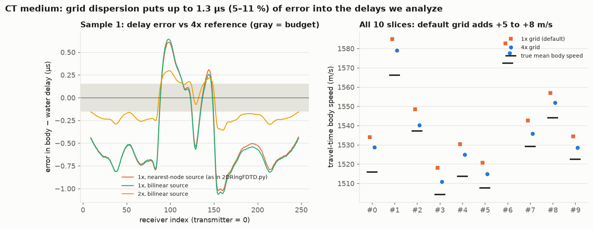
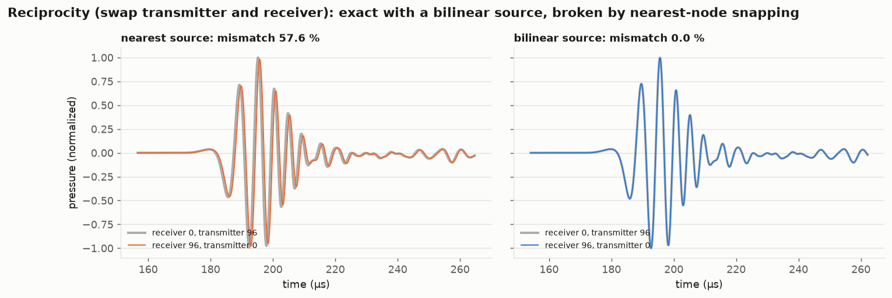
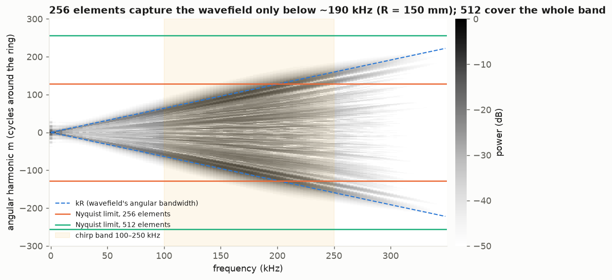

# Phase 2: is the forward simulator accurate enough?

*Completed 2026-10-07. Part of the plan in [critical_review.md](critical_review.md). Code: `desmond/src/phase2_numerics.py` (experiments) and `desmond/src/make_phase2_figures.py` (figures); raw results in `desmond/data/generated/phase2/results.json`.*

## Summary

**The default 2D grid (0.78 mm, about 7 points per wavelength at 250 kHz) is too coarse for quantitative work.** Each finding below comes from one experiment:

| Finding | Default grid (1×) | What it means |
| --- | --- | --- |
| Body-minus-water delays are off | median 3 %, worst 16 % of the delay | Outside the 1 % budget. A **4× finer grid** (0.2 mm) reaches a median 0.7 %, worst 2.4 % |
| Waveforms are wrong | about 110 % mismatch | Inadequate for full-waveform inversion |
| Travel-time body speed is biased | **+5 to +8 m/s**, consistently | The Phase 1 fat correlation is unchanged (r = −0.97 on both grids), because the bias is consistent across slices |
| Snapped point source breaks reciprocity | 26 % median mismatch | **Interpolating the source makes it exact.** One-function fix |
| 256 elements undersample the ring (R = 150 mm) | above about 190 kHz | 5 % of the 100–250 kHz energy is aliased; 512 elements cover the whole band |
| Absorbing boundary reflects | 7.5 % of trace energy, after about 209 µs | Doesn't touch first arrivals; contaminates the late signal FWI uses |

**Recommended configuration** (for the advisor to confirm, `decisions.md`):

- simulate "measured" data on a **4× grid** with an **interpolated source**;
- invert on a coarser grid (2×) with at least 10–15 points per wavelength, which also avoids the inverse crime;
- use **512 elements**, or cap the band at about 190 kHz for this ring size;
- keep receivers before the boundary reflections arrive, or add margin.

## The experiments

All runs use the advisor's GPU solver (`fdtd2d.torch_backend`) unchanged. Only the driver loop is new, so it can:

- run the same medium on finer grids;
- inject the source at the nearest grid node (as `2DRingFDTD.py` does) or bilinearly;
- use one continuous chirp on every grid.

The geometry is sample 1 (ring radius 150 mm, base grid 512² at 0.781 mm) with its Phase 1 sound-speed map.

### 1. Water versus the exact solution

A homogeneous water bath has an exact 2D solution, the line-source Green's function convolved with the chirp. The water runs are compared with it at three resolutions.



| Grid | Spacing | Points per wavelength at 250 kHz | First-arrival error at 300 mm | Waveform mismatch (median) |
| --- | --- | --- | --- | --- |
| 1× (default) | 0.78 mm | 7.6 | 0.85 µs | 92 % |
| 2× | 0.39 mm | 15 | 0.52 µs | 26 % |
| 4× | 0.20 mm | 30 | 0.19 µs | 6.5 % |

**Reading the left panel:**

- The 2× and 4× waveforms converge onto the exact one, which validates the exact solution itself.
- On the default grid the high-frequency end of the chirp travels too slowly (numerical dispersion), so the pulse arrives late and smeared.
- Beyond about 270 mm it no longer lines up with the exact waveform within one cycle. A cross-correlation then locks onto the wrong cycle (reporting up to 8.7 µs). That's why the table uses first-arrival picks, which cannot skip a cycle.

### 2. Grid convergence on the CT medium

The same sound-speed map (nearest-neighbour upsampled, so the medium is identical) at 1×, 2×, 4× and 8× refinement, with 8× (0.1 mm, 4096², 35 000 time steps) as the reference. The quantity that matters is the **body-minus-water first-arrival delay**, the signal behind every travel-time result so far.



| Grid | Delay error, median | Delay error, max | Relative error, median | Relative error, worst | Waveform mismatch |
| --- | --- | --- | --- | --- | --- |
| 1×, nearest-node source (current) | 0.69 µs | 1.22 µs | 3.2 % | 16 % | 124 % |
| 1×, bilinear source | 0.71 µs | 1.25 µs | 3.1 % | 16 % | 110 % |
| 2×, bilinear | 0.32 µs | 0.55 µs | 2.2 % | 7.1 % | 35 % |
| 4×, bilinear | **0.11 µs** | 0.20 µs | **0.7 %** | 2.4 % | 7 % |

The relative errors cover receivers whose delay exceeds 5 µs; the body delays here run from −0.5 to −17 µs.

On sample 1 the 1× error is mostly systematic, with arrivals through the body coming out too early. Across all 10 slices (right panel), the default grid inflates the travel-time body speed by **+5.0 to +8.3 m/s** (median +5.8) compared with 4×.

| Travel-time body speed vs true mean (10 slices) | 1× grid | 4× grid |
| --- | --- | --- |
| Bias, median (range) | +13.3 m/s (+10 to +19) | +6.9 m/s (+3 to +13) |
| Correlation with fat share | r = −0.973 | r = −0.969 |

So half of the travel-time bias reported in Phase 1 was grid dispersion. The remaining +7 m/s is physical: first arrivals take the fastest path, so a straight-ray average comes out fast.

### 3. Absorbing-boundary reflections

The first-order Mur boundary sits 8 cells outside the ring. A run on a domain padded by 128 cells per side differs by a median **7.5 %** (max 22 %) of trace energy. The differences start around 209 µs (median), after the direct arrivals for most receivers. The farthest receivers' direct waves arrive near 200 µs, so they are the most exposed.

**First-arrival analysis is unaffected. Full-waveform inversion of the late signal is not:** truncate traces before that time, enlarge the margin, or switch to a perfectly matched layer (PML).

### 4. Reciprocity

Swapping transmitter and receiver should give the same trace.



- **Nearest-node source (current):** the transmitter snaps to the nearest grid node while receivers are sampled bilinearly. The two directions differ by a median 26 % (up to 58 %), with up to 0.53 µs timing shift.
- **Bilinear source:** injecting the source with the same bilinear weights the receivers use makes the discrete problem exactly symmetric, and reciprocity holds to machine precision (0.0 %).

The advisor's TFNO plan lists reciprocity as an acceptance check, so this fix matters beyond accuracy.

### 5. Ring sampling (spatial aliasing)

Recording on 1024 receivers and transforming around the ring shows how many elements the wavefield needs. Channels within 8 elements of the transmitter are muted, because its near field is a spike in angle.



The wavefield's angular content grows with frequency as kR = 2πfR/c (dashed lines).

- **256 elements** hold it only up to about **190 kHz** on this 150 mm ring. 5.3 % of the 100–250 kHz energy lies beyond their sampling limit.
- **512 elements** capture everything up to about 370 kHz.
- **Larger bodies** (ring radius up to 190 mm) lower the 256-element limit to about 150 kHz.

Aliasing does not affect single-trace first arrivals. It does affect anything that combines traces across the ring (FWI gradients, TFNO input features).

## Error budget at the default settings

| Error source | Effect on body delays (9–22 µs signal) | Effect on full waveforms | Fix |
| --- | --- | --- | --- |
| Grid dispersion (7 points/λ) | 0.7 µs median, 1.25 µs max (3 %, up to 16 %) | about 110 % mismatch | 4× grid for data; 2× (or capped band) for inversion |
| Nearest-node source | ≤ 0.06 µs on top of dispersion | breaks reciprocity (26 %) | bilinear source injection |
| Mur boundary (8-cell margin) | none (arrives after ~209 µs) | 7.5 % of energy, late | truncate, wider margin, or PML |
| 256 elements on a 150–190 mm ring | none per trace | aliasing above ~150–190 kHz | 512 elements, or cap the band |
| Single precision (float32) | not limiting at these error levels | — | — |

**Exit criterion:** first-arrival error below about 1 % of the body signal. **Met in the median on the 4× grid** (0.7 %, worst receiver 2.4 %). **Not met** on the default grid (3 %, worst 16 %) or on 2× (2.2 %).

## Cost of the recommended configuration

These are single-shot times on the A6000 (sample 1, transmitter 0, no batching):

| Grid | Spacing | Time steps | Body shot | Water shot |
| --- | --- | --- | --- | --- |
| 1× | 0.78 mm | 4 400 | 1 s | 0.4 s |
| 2× | 0.39 mm | 8 800 | 2 s | 1 s |
| 4× | 0.20 mm | 17 500 | 11 s | 5 s |
| 8× | 0.10 mm | 35 100 | 77 s | 36 s |

A full 256-transmitter acquisition on the 4× grid is about 47 minutes per slice unbatched. The advisor's batched shot runner (16 shots per GPU batch in `invert_ring.py`) should cut that several-fold; I haven't tested it at 4×.

## Decisions needed (in `decisions.md`)

1. **Data grid:** generate all simulated measurements on the 4× grid.
2. **Inversion grid and band:** invert on 2× with the full band, or on 1× with the band capped near 150 kHz (at least 10 points per wavelength in fat).
3. **Source injection:** switch to bilinear. It's a small upstream change, proposed in `upstream_suggestions.md`.
4. **Elements:** 512 elements, or cap the band at about 150–190 kHz depending on ring size.
5. **Boundaries:** truncate traces before reflections, or widen the margin or use a PML for FWI.

## How to reproduce

```bash
conda activate soundwave
S=desmond/data/generated/pathB_retrieved_n10/sample_0001
python desmond/src/phase2_numerics.py --sample $S                                     # water, converge (1/2/4x), boundary, reciprocity, aliasing
python desmond/src/phase2_numerics.py --sample $S --experiments converge --levels 1 2 4 8   # 8x reference (~3 min)
python desmond/src/phase2_numerics.py --sample $S --experiments traveltime            # 1x vs 4x on all 10 slices (~4 min)
python desmond/src/make_phase2_figures.py --sample $S
python -m pytest desmond/tests -m "not slow"                                          # includes 5 tests of the measurement helpers
```
