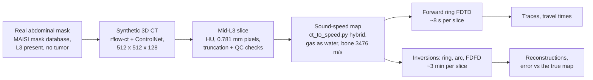
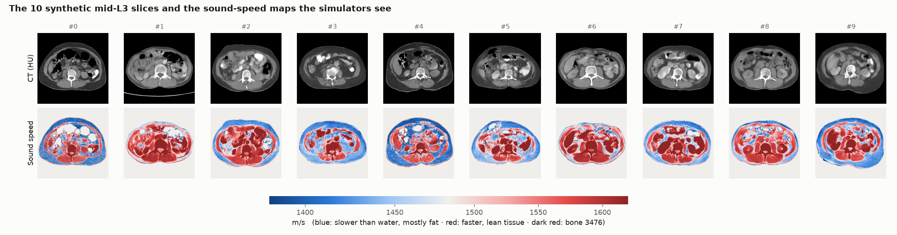
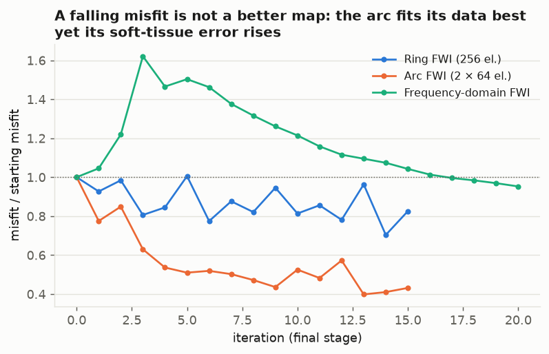

# Synthetic L3 CT to Ultrasound Simulation: Pipeline Guide

*As of 2026-10-06. Companion to [model_notes.md](model_notes.md) (MAISI model reference).*

## Summary

Ten synthetic abdominal CT slices at the mid-L3 level are ready. They are converted to sound-speed maps and run through the ring ultrasound simulation. Ring, arc and frequency-domain inversions also run on them, about 3 minutes each on the lab A6000.

The forward simulations already say something useful:

- First arrivals through the abdomen come **9–22 µs earlier than through water**, because lean tissue and bone are faster than water.
- The travel times recover each body's **average sound speed to within a median 4.5 m/s**.
- That speed falls as the **fat share rises (r = −0.80)**.

With untuned defaults, inversions differ sharply by coverage:

- **Full-ring FWI** cuts soft-tissue error by 21 % (71 → 57 m/s).
- **Limited-angle arc FWI** makes it 9 % worse while fitting its data better.
- **Frequency-domain FWI** barely moves.

Bone handling, contrast remapping and inversion tuning come before an inversion study (see [Readiness](#5-readiness-and-known-issues)).



Each sample starts from a real patient's segmentation, so the anatomy is realistic and only the CT intensities are synthetic. The true sound-speed map is known for every pixel, which is what lets us score the simulations.

## 1. Generating the CT samples

Each sample is a full 3D CT volume from NVIDIA's MAISI `rflow-ct` model. The model is conditioned on a real abdominal segmentation mask, and we keep the mid-L3 axial slice. Ten samples take about 4 minutes on the A6000.

The model only makes 3D volumes (smallest 256×256×128). Volumes are 512×512×128 at 0.781×0.781×2.981 mm, a 400×400×382 mm field of view and the most common size in MAISI's training data.

1. **Pick a mask.** MAISI's `find_masks` selects tumor-free training masks that span the abdomen and contain L3. We keep the masks whose field of view is closest to ours, shuffle them with the base seed, and give each sample its own mask. MAISI then applies a ±1 % random zoom.
2. **Synthesize the CT.** A ControlNet plus the rectified-flow diffusion model (30 steps) generate a CT that follows the mask. Output is HU stored as int16, clipped to −1000…1000.
3. **Find the landmark.** Mid-L3 is the axial slice at the centroid of the mask's L3 label (MAISI label 35).
4. **Reject and redraw** a sample if any of these hold:
    - L3 is cut off at the top or bottom of the scanned region;
    - the body touches the side edges of the source scan;
    - a tumor label appears in the slice;
    - MAISI's organ-HU quality check fails.
5. **Save** the HU slice, its label slice, full metadata, the full volumes and a preview.



*Top: the 10 mid-L3 CT slices (window 500 / level 50). Bottom: the sound-speed maps the simulators receive.*

- **Colour scale.** Blue is slower than water (fat), red is faster (lean tissue), and dark red is bone at 3476 m/s.
- **Range of bodies.** The set runs from lean (#1, 16 % fat) to heavily fatty (#3, 60 %).
- **What to look for.** The subcutaneous fat ring (blue rim), the spine, and white holes where bowel gas was replaced by water.

### Why retrieved masks (Path B) and not generated masks (Path A)

MAISI can also *generate* a new anatomy mask with a second diffusion model (Path A). We compared 10 samples of each:

| | Path A: generated mask | Path B: retrieved mask (chosen) |
| --- | --- | --- |
| Attempts needed for 10 good slices | 32 (12 L3 cut off, 6 body cut at the sides, 4 other) | 11 (1 failed the HU check) |
| GPU time per good slice | 4.7 min | 0.3 min |
| Anatomy | Fully synthetic, new each seed | A real patient's segmentation (AMOS, KiTS and similar), ±1 % zoom |
| Bias | Against large bodies: the mask model's fixed 384 mm cube cuts them | Variety limited to the pool of closest-FOV masks (22 here) |

In both paths the CT intensities are synthetic. Path B wins on realism of the anatomy and on cost. Path A remains available as `--mask-source generated`. The full comparison is in `desmond/data/generated/compare_A_vs_B/`.

### Commands

```bash
conda activate soundwave
cd /sci-it/projects/sarang-lab/desmond/SoundWaveSimulation

python desmond/src/generate_slices.py --run-name l3_n10                          # 10 samples, seeds 0-9
python desmond/src/generate_slices.py --num-volumes 50 --run-name l3_n50 --no-volumes
```

Each run writes `desmond/data/generated/<run_name>/`, with one `sample_XXXX/` folder per sample:

| File | Contents |
| --- | --- |
| `L3_mid_hu.npy` | 512×512 int16 HU slice, radiological orientation (anterior up, patient right on the image left) |
| `L3_mid_label.npy` | MAISI organ labels for the same slice |
| `meta.json` | Seed, model commit, mask file, slice index, spacing, rejected attempts and reasons |
| `volume_image.nii.gz`, `volume_label.nii.gz` | Full 3D volumes (RAS) |
| `preview.png` | Axial slice, labels, and a sagittal view with the slice marked |

The same seed reproduces a bit-identical slice. Re-running a command skips finished samples.

## 2. From CT slice to sound-speed map

`ct_to_speed.py` turns each HU slice into a sound-speed map. We use the `hybrid` mapping with internal gas replaced by water.

```bash
D=desmond/data/generated/<run>/sample_0000
python ct_to_speed.py $D/L3_mid_hu.npy --pixel-spacing-mm 0.781 \
    --mapping hybrid --air-as-water --output $D/acoustic.npz --figure $D/acoustic.png
```

1. **Body mask.** Pixels above −500 HU; the script keeps the largest connected component and fills its holes. A CT table, if present, becomes coupling water.
2. **Six tissue classes**, from HU plus depth below the skin:
    - air (< −190 HU);
    - bone (≥ 200 HU);
    - fat (−190 to −30 HU): subcutaneous within 25 mm of the skin, visceral deeper;
    - other soft tissue: muscle near the surface, visceral organs deeper.
3. **Sound speed.** Fat and soft tissue go through a continuous HU → density → speed fit (k-Wave/Schneider density, then the Mast relation). Bone gets a fixed 3476 m/s; air and internal gas get 1480 m/s (water).

| Mapping | Fat and soft tissue | Bone | Use |
| --- | --- | --- | --- |
| `categorical` | One literature value per class (fat 1478, muscle 1547, organs 1595 m/s) | 3476 m/s | Piecewise-constant phantoms |
| `regression` | HU → density → speed for every pixel | Same fit, extrapolated | Not recommended for bone |
| `hybrid` (ours) | HU → density → speed | 3476 m/s | Default for abdominal simulation |

The saved slices are already in the orientation `ct_to_speed.py` expects. Pass the in-plane spacing (0.781 mm) explicitly, because a `.npy` file carries none. The simulators then centre the body, resample it onto their grid, place the ring 10 mm outside the skin, and fill the rest with 1480 m/s water.

**Measured on our 10 slices:**

- Median body speed is 1461–1565 m/s.
- 2.0–5.5 % of each body sits at bone speed.
- 1.2–16.5 % sits below 1400 m/s (fat down to 1315 m/s).

**Contrast-agent caveat.** MAISI generates contrast-enhanced CT. Oral contrast in bowel and enhancing kidney cortex above 200 HU therefore become 3476 m/s "bone". That is 1.1 % of the body in the median slice and up to 3.1 %. `L3_mid_label.npy` marks bowel, kidneys and vessels, so these pixels can be remapped (see [Readiness](#5-readiness-and-known-issues)).

## 3. Running the simulations

Every simulator that takes CT input reads `acoustic.npz` through `--ct-speed`. All of them model 2D acoustic waves in sound speed only, with constant density and no attenuation. The grid spacing follows the body size, about 0.8 mm on these slices.

| Script | What it simulates | Output | Measured |
| --- | --- | --- | --- |
| `2DRingFDTD.py` | Forward, time domain: one of 256 ring elements fires a 100–250 kHz chirp, and all others record | Pressure field, 256-trace gather, saved traces | 8 s per slice; ran on all 10 |
| `invert_ring.py` | Full-waveform inversion (FWI) with the full ring | Reconstructed map, error map, misfit, interior RMS | 194 s with `--multiscale` (2 → 1 → 0.5 mm) |
| `invert_arc.py` | Limited-angle FWI: a 64-element transmit arc (30°) facing a 64-element receive arc | Same as the ring | 153 s with `--multiscale` |
| `fdfd_ring/invert_ring_fdfd.py` | Frequency-domain FWI at 50, 75 and 100 kHz on a 161×161 grid | Same | 168 s |
| `2DArcFDTD.py` | Forward arc simulation | — | Built-in phantoms only (no `--ct-speed`) |

```bash
D=desmond/data/generated/<run>/sample_0001

# Forward ring simulation on the CT map, and on the same geometry filled with water (the reference)
python 2DRingFDTD.py --ct-speed $D/acoustic.npz --device cuda:0 --no-show \
    --save-figure $D/ring_fdtd.png --save-traces $D/ring_traces.npz
python -c "import numpy as np; z=dict(np.load('$D/acoustic.npz')); z['speed_m_s'][:]=1480; np.savez('$D/acoustic_water.npz', **z)"
python 2DRingFDTD.py --ct-speed $D/acoustic_water.npz --device cuda:0 --no-show \
    --save-traces $D/ring_traces_water.npz

# Inversions; capture_inversion.py also saves the true and reconstructed maps as .npz
# (always pass --save-figure: without it the scripts overwrite the dashboard PNGs in the repo root)
python desmond/src/capture_inversion.py --out $D/inversions/ring_maps.npz -- invert_ring.py \
    --ct-speed $D/acoustic.npz --multiscale --device cuda:0 --no-show --save-figure $D/inversions/ring.png
python desmond/src/capture_inversion.py --out $D/inversions/arc_maps.npz -- invert_arc.py \
    --ct-speed $D/acoustic.npz --multiscale --device cuda:0 --no-show --save-figure $D/inversions/arc.png
python desmond/src/capture_inversion.py --out $D/inversions/fdfd_maps.npz -- fdfd_ring/invert_ring_fdfd.py \
    --ct-speed $D/acoustic.npz --device cuda --allow-tf32 --no-show --save-figure $D/inversions/fdfd.png

# All figures in this document
python desmond/src/make_simulation_figures.py --run desmond/data/generated/<run> --inversion-sample 1
```

- **Device flag.** Pass `--device cuda:0`. Under torch 2.14 the default device fails in these scripts with "Expected a torch.device with a specified index".
- **No real measurements needed.** The inversions generate their own "observed" data from the true map. That is an inverse-crime setup: the same solver produces the data and inverts it.
- **Unmodified scripts.** `desmond/src/capture_inversion.py` runs the advisor's scripts as they are and only intercepts the maps they already pass to their summary or plot functions.

## 4. What the simulations tell us

> **Note (2026-10-07):** the results in this section use the advisor's `ct_to_speed.py` hybrid maps. The Phase 1 IT'IS-anchored maps lower travel-time body speeds by a median 26 m/s and sharpen the fat-share correlation from r = −0.81 to r = −0.97. See [phase1_speed_maps.md](phase1_speed_maps.md).

A forward run shows how the abdomen changes a wave: its **arrival time** carries the average sound speed along the path, and its **amplitude and late coda** carry scattering. An inversion tries to turn all of that back into the sound-speed map, and is scored against the known true map.

### 4.1 Reading a forward simulation


**A. Geometry.** The body sits inside the 256-element ring, here sample 1 (lean). Element 0 transmits and the element straight across (128) is the "opposite receiver". The simulator plots with y up, so anatomy appears upside down relative to the CT.

**B. All 256 recordings at once.** Each row is a receiver and time runs left to right. The dashed curve is when the wave would arrive through water alone.

- **Near the transmitter**, the wave never enters the body and arrives exactly on the dashed curve.
- **Across the ring**, it arrives *before* the dashed curve: the path through the body is faster than water.
- **After the first arrival**, a long tail of weaker wiggles is scattering from organ, bone and gas boundaries.

**C. One receiver, body vs water.** At the opposite receiver, the first arrival through the abdomen (blue) comes 18.3 µs before the water-only wave (gray). It is followed by a scattered coda that water alone never produces.

The **peak** of the signal is not the first arrival. On sample 2 the strongest wiggle came 72 % late, because the spine and gas scatter the direct wave. Travel-time work must pick first arrivals, as these figures do (first |p| above 2 % of the water peak).

### 4.2 Travel-time delay across the ring


Each curve is one transmitter's first-arrival delay against water, across all receivers. Negative means earlier than water.

- **Receivers within 8 elements of the transmitter** are excluded (water-only paths).
- **Straight-across paths** (receivers 90–150) cross the most tissue and show the largest lead: up to 22 µs for the lean #1, about 14 µs for the 60 %-fat #3.
- **Paths that only graze the body** run through the subcutaneous fat layer and arrive slightly *late* (small positive bumps near receivers 55–70 and 160–190 for the fatty bodies).
- **Sharp single-receiver spikes** are first-arrival picking jumps where two wave paths compete. They are not anatomy.

### 4.3 Travel time encodes body composition


**How the estimate works.** A straight-ray model turns each slice's delays into an average body speed: c = L / (L / 1480 + Σ delay), where L is the total straight path length inside the body. Only receivers whose straight path crosses at least 20 mm of body are used.

- **It matches the truth.** Blue dots are these estimates; open circles are the true mean speed over the body. They agree within a median 4.5 m/s, and the worst case is 42 m/s (#3).
- **It tracks fat.** The estimate falls from 1621 m/s at 16 % fat to 1519 m/s at 52 % fat (Pearson r = −0.80 across 10 slices).

So even without an image reconstruction, ring travel times carry a body-composition signal. The scatter around the trend comes from bone share and the visceral/subcutaneous fat split. Ten samples are enough to see the trend, but not to fit a calibration.

### 4.4 Inversions

All three inversions ran on sample 1 with default settings. The figures come from `desmond/src/capture_inversion.py`, which saves each script's true and reconstructed maps.


The top row is speed and the bottom row is error (reconstruction − truth). The colour range is narrowed to soft tissue (1380–1620 m/s), so bone saturates.

- **Ring FWI** recovers the body outline and its bulk speed (faster than water, red), smoothed. The organs are not resolved yet, and the body interior is underestimated (blue error).
- **Arc FWI** produces vertical streaks along its transmit–receive axis: the classic limited-angle artifact. With only 30° arcs at the top and bottom, it sees almost no horizontal structure.
- **Frequency-domain FWI** at 50–100 kHz barely moves from the uniform start.
- **The spine** saturates dark blue in every error map. It is 3476 m/s, but every inversion caps speed at 2000 m/s.

| Method (sample 1, default settings) | Soft-tissue RMS: start → end | Change | Interior RMS (incl. bone) | Wall time |
| --- | --- | --- | --- | --- |
| Ring FWI, 256 elements, `--multiscale` | 71.3 → 56.5 m/s | **−21 %** | 294 → 293 m/s | 194 s |
| Arc FWI, 2 × 64 elements, `--multiscale` | 71.3 → 77.9 m/s | +9 % | 294 → 297 m/s | 153 s |
| Frequency-domain FWI, 50–100 kHz | 73.2 → 69.4 m/s | −5 % | 301 → 300 m/s | 168 s |

"Start" is the uniform 1480 m/s model, measured on each method's own grid. Soft tissue means every interior pixel slower than 2000 m/s. The scripts print only interior RMS, and that number hides the ring's real gain: bone (2 % of pixels, error about 2000 m/s RMS) dominates it.



**A falling misfit is not a better map.** The arc reduces its data misfit the most (−57 %) while its soft-tissue error *rises*. With limited angles, many maps fit the same data, so the optimizer finds a wrong one. The ring's misfit oscillates, because each update uses 4 random transmitters out of 256. Frequency-domain FWI first rises and only returns to its starting misfit after 17 iterations.

**What this tells us:** full-ring coverage starts to recover abdominal sound speed even with untuned defaults. Limited-angle arcs need priors or regularization before they help, and every method needs a decision on bone.

### 4.5 Questions this pipeline can answer

1. How accurately can ring FWI recover abdominal soft-tissue speed (fat, muscle, organs) on realistic anatomy, and how does that vary across patients?
2. How much does limited-angle arc coverage lose against the full ring, on the same slices?
3. How much do the spine and bowel gas limit what can be seen, and do known-bone priors or wider bounds fix it?
4. Can ring travel times alone estimate fat fraction? Section 4.3 suggests yes, and a calibration needs more samples.
5. Can a reconstruction separate subcutaneous fat, visceral fat and muscle? The CT tissue labels give per-pixel ground truth.

## 5. Readiness and known issues

Sample generation, forward simulations and the travel-time analysis are ready to scale. Inversion studies run end to end, but their results won't mean much until the items below are settled.

**Decisions and fixes before an inversion study:**

- [ ] **Bone in the inversion:** widen the bounds (for example `--c-min 1300 --c-max 3500`, which needs a smaller time step and runs slower), or treat bone as known and invert only soft tissue.
- [ ] **Contrast agent:** remap pixels above 200 HU that `L3_mid_label.npy` marks as bowel, kidney or vessel to soft-tissue speed. Not implemented yet.
- [ ] **Tune the inversion on one slice** (more iterations, more transmitters per gradient via `--n-shots`, learning rate). The ring's −21 % soft-tissue gain is the baseline to beat; the arc needs regularization (`--reg`) or priors.
- [ ] **Report error by tissue.** `make_simulation_figures.py` already reports soft-tissue and bone RMS; per-class fat / muscle / organ error is still to add.
- [ ] **More samples** for the travel-time vs composition analysis: 50+ slices instead of 10.
- [ ] **Commit the pipeline code** (everything under `desmond/`) to a branch for review.

**Known limitations of the setup:**

- **2D only:** no out-of-plane scattering or anatomy.
- **Sound speed only:** density is constant and there is no attenuation, so amplitudes are qualitative.
- **Gas is replaced by water** (`--air-as-water`). Real bowel gas would block the wave almost completely.
- **Inverse crime:** the same solver makes and inverts the data, so results are optimistic.
- **Patient selection:** patients wider than the original scan's field of view (about 400 mm) are excluded.
- **Sample variety:** each sample reuses a real patient's mask. Asking for more samples widens the mask pool automatically, but later masks match our field of view less closely.

## 6. Reproducibility

Every slice can be regenerated bit-for-bit from its `meta.json` (seed, model commit, mask file, code commit). Every figure here is regenerated by `desmond/src/make_simulation_figures.py`.

| Item | Value |
| --- | --- |
| Repo | `SoundWaveSimulation`, based on `origin/main` at 0007cc8 (the pipeline code is not committed yet) |
| Environment | conda env `soundwave` from `desmond/environment.yml`: Python 3.12, torch 2.14.1 + CUDA 13.0, MONAI 1.6.1 |
| Model | NV-Generate-CTMR at commit da438fe (read-only), `rflow-ct` weights |
| Mask database | `desmond/data/maisi_cache/datasets/` (14 GB unpacked) |
| Seeds | Sample *i* uses seed `base_seed + i`; retry *k* adds 100000·*k* |
| Hardware | NVIDIA RTX A6000 48 GB; peak about 18 GB during generation |
| Samples and simulation outputs | `desmond/data/generated/pathB_retrieved_n10/` |
| Figures and metrics | `desmond/docs/figures/` (`simulation_metrics.csv` holds every number in section 4) |

Code:

- `desmond/src/generate_slices.py`: sample generation
- `desmond/src/compare_runs.py`: Path A vs B comparison
- `desmond/src/capture_inversion.py`: saves inversion maps from the unmodified scripts
- `desmond/src/make_simulation_figures.py`: all figures and metrics in this document
- `desmond/configs/slices.yaml`: generation settings
- `desmond/tests/test_generate_slices.py`: unit tests plus GPU smoke tests
